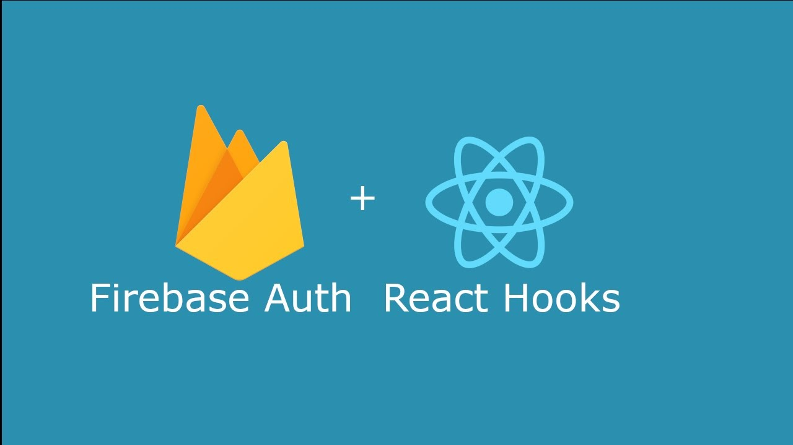

<p align="center">
  

  <a href="https://www.linkedin.com/in/luanyata/">
    
  </a>

  

  <a href="https://github.com/luanyata/firebase-auth-hook/stargazers">
    
  </a>
</p>

## Sobre:

Hook simples para realizar login / logout usando o [Firebase Auth](https://firebase.google.com/docs/auth/web/start).

## Dependencias:
  *  [firebase](https://www.npmjs.com/package/firebase)
  *  [axios](https://www.npmjs.com/package/axios)


## Importante:

* O hook leva em consideração que toda as configurações de comunicação com o firebase estão realizadas.
* Caso não conheca como ***CONTEXT API*** recomendo a [leitura](https://reactjs.org/docs/context.html).


## Recursos:

* Login social com o Google:    
* Login social com o Facebook
* Login utilizando Usuário/Senha
* Logout
* Objeto user contendo dados do usuário: Nome, Email, Avatar, etc...


```tsx
import {useAuth} from 'PATH/auth'
//...
const { signInEmailAndPassword, signInFacebook, signInGoogle, logout, user } = useAuth();
```